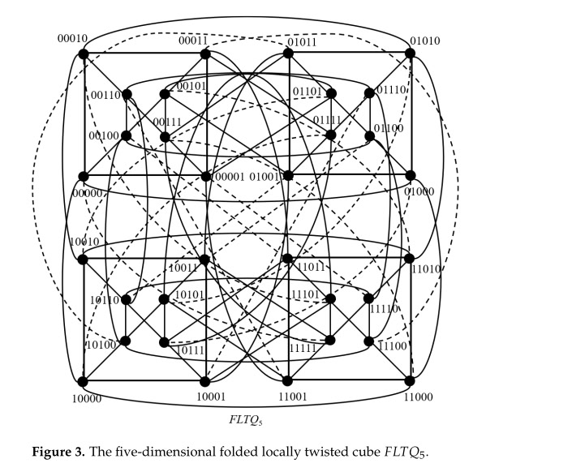
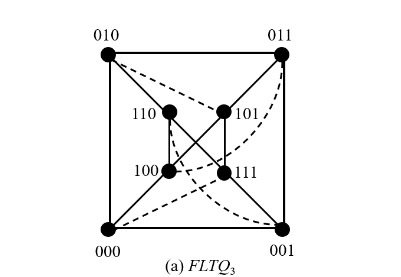

# Folded Locally Twisted Cube (FLTQ_n) Implementation Plan

## Motivation

The current propagation layer uses two topologies:
- **Tree propagation** (`trees.go`) - low diameter but single-parent bottleneck; one blocked parent cuts off entire subtree.
- **Hypercube propagation** (`hypercube.go`) - `n` neighbors per node, diameter `n`. For 10,000 participants (`n=14`), the diameter is 14 hops and each node has 14 connections.

FLTQ_n offers:
- **Diameter**: `ceil(n/2) + 1` (8 hops for n=14 vs 14 hops for standard hypercube).
- **Node degree**: `n + 1` (15 for n=14) - only one extra edge per node over standard hypercube.
- **Redundancy**: The combination of twisted edges and complementary (folded) edges provides multiple vertex-disjoint paths, making it extremely difficult for a blocking participant to partition the network.

---

## Architecture Overview

```
FLTQNode
  Address    string
  Position   uint16     // n-bit binary label
  Neighbors  []string   // all n+1 neighbors (n twisted + 1 complementary)
  Dimensions int

FLTQCube
  Index      int
  Dimensions int        // n
  Size       int        // 2^n
  Nodes      map[string]*FLTQNode
  Positions  []*FLTQNode
```

Follows the same patterns as the existing `Hypercube` / `HypercubeNode` structs in `hypercube.go`.

---

## Visualization





## Implementation Steps

### Step 1: Core topology builder - `fltq.go`

New file: `poc/propagation/fltq.go`

#### 1.1 Node addressing & weighted position assignment

Assign each participant a unique n-bit position (same as current hypercube: `ceilLog2(numParticipants)`).
Pad to `2^n` positions; unused positions are nil (same as current hypercube handles it in `buildHypercubeWithIndex`).

**Weighted shuffle strategy for protecting high-weight participants:**

Reuse `weightedDeterministicShuffle` from `trees.go` (score = `weight + rand * weight * 0.3`).
Call it once per FLTQ instance with seed derived from `(blockHash, cubeIndex)`.
Assign positions in shuffle order: position 0 to the highest-scored participant, position 1 to the next, etc.

This matters because in FLTQ (and any hypercube-like topology) **adjacent positions differ by few bits**. Positions that are close in numeric order share many bit-flip neighbors:

- Positions 0 (`0000`) and 1 (`0001`) differ by 1 bit → direct LTQ neighbors.
- Positions 0 (`0000`) and 2 (`0010`) differ by 1 bit → direct LTQ neighbors.
- Positions 0 (`0000`) and 4 (`0100`) differ by 1 bit → direct LTQ neighbors.

By placing high-weight participants in the low-position region (positions 0, 1, 2, ...), they naturally become **LTQ neighbors of each other**. This creates a dense cluster of high-stake, presumably-honest nodes that relay for one another. The effect:

1. **High-weight nodes get high-weight neighbors** — their `n` twisted edges connect mostly to other high-weight nodes in nearby positions, forming a reliable relay cluster at the core.
2. **Low-weight nodes (higher positions)** neighbor a mix of other low-weight nodes and some high-weight nodes (via bit-flips that reach into the low-position region). They still benefit from connectivity but don't dominate the core relay paths.
3. **Complementary (folded) edge crosses regions** — position `p` connects to `p XOR mask`. A high-weight node at position 0 (`00...0`) connects to position `11...1` (the highest position, a low-weight node). This cross-region link provides path diversity — even if the local high-weight cluster is partially blocked, the folded edge gives an escape route to the opposite end of the topology.
4. **30% randomness in scoring** ensures that across different FLTQ instances (different seeds per block), the exact cluster composition varies. A node that is position 3 in FLTQ-0 might be position 7 in FLTQ-1, giving it a different neighbor set. This prevents an attacker from predicting and targeting the exact neighbor set across all instances.

**Why this is better than uniform random assignment:**

With uniform random positioning, a high-weight node's neighbors are drawn uniformly from all participants. If 33% are attackers, each neighbor has a 33% chance of being an attacker regardless of weight. With weighted positioning, a high-weight node at position 0 has neighbors at positions 1, 2, 4, 8, ... — all filled by other high-weight participants who are statistically less likely to be attackers (higher stake = more to lose). The probability that all `n+1` neighbors are attackers drops from `f^(n+1)` to effectively `f_low^(n+1)` where `f_low` is the attacker fraction among high-weight participants (much smaller than the overall `f`).

**Position assignment — single shuffle, not per-dimension:**

Unlike the current `hypercube.go` which loops over dimensions (lines 86-96, where each iteration overwrites the previous — effectively only the last shuffle matters), FLTQ should perform exactly **one** weighted shuffle per instance:

```go
seed := makeFLTQSeed(blockHash, cubeIndex)
shuffled := weightedDeterministicShuffle(participants, seed)
for i := 0; i < realSize && i < cubeSize; i++ {
    positionToParticipant[i] = shuffled[i]
}
```

This is clean, deterministic, and produces the desired weight-based clustering.

#### 1.2 Baseline LTQ_n wiring (twisted edges)

Build the Locally Twisted Cube recursively. The LTQ_n is constructed from two disjoint copies of LTQ_{n-1}:

- **Copy 0**: Nodes with addresses `0 x_{n-1} x_{n-2} ... x_2 x_1` (MSB = 0).
- **Copy 1**: Nodes with addresses `1 x_{n-1} x_{n-2} ... x_2 x_1` (MSB = 1).

**Cross-half connection rule**: A node with address `0 x_{n-1} x_{n-2} ... x_2 x_1` in Copy 0 connects to node `1 (x_{n-1} XOR x_1) x_{n-2} ... x_2 x_1` in Copy 1, where `x_1` is the least significant bit (LSB).

Implementation approach:

```go
func ltqNeighbor(pos int, dim int, n int) int {
    // For dimensions 0..n-2: standard hypercube flip on bit `dim`
    // For dimension n-1 (the cross-half link):
    //   flip bit n-1 (MSB) AND conditionally flip bit n-2 based on bit 0 (LSB)
    
    if dim < n-1 {
        return pos ^ (1 << dim)
    }
    
    // Cross-half twisted link
    flipped := pos ^ (1 << (n - 1))  // flip MSB
    lsb := pos & 1                     // u_n (bit 0)
    if lsb == 1 {
        flipped ^= (1 << (n - 2))      // flip bit n-2 (u_2)
    }
    return flipped
}
```

This should be implemented recursively for correctness, but the iterative per-dimension approach works since each dimension adds one edge per node.

Full recursive approach for all n dimensions:

```
func buildLTQEdges(n int) -> edges for all 2^n nodes:
    Base case: n=1 -> two nodes {0, 1} connected.
    Recursive:
      - All edges from LTQ_{n-1} in Copy 0 (prefix 0)
      - All edges from LTQ_{n-1} in Copy 1 (prefix 1)
      - Cross edges: for every node 0 x_{n-1} ... x_2 x_1 in Copy 0,
        connect to 1 (x_{n-1} XOR x_1) x_{n-2} ... x_2 x_1 in Copy 1
        where x_1 is the least significant bit
```

**Example for n=3:**

All 8 nodes and their LTQ neighbors:

| Node (binary) | Dim 0 (flip bit 0) | Dim 1 (flip bit 1) | Dim 2 (twisted) |
|---------------|-------------------|-------------------|-----------------|
| 000 | 001 | 010 | 100 |
| 001 | 000 | 011 | 101 |
| 010 | 011 | 000 | 110 |
| 011 | 010 | 001 | 111 |
| 100 | 101 | 110 | 000 |
| 101 | 100 | 111 | 011 |
| 110 | 111 | 100 | 010 |
| 111 | 110 | 101 | 001 |

**Dim 2 (cross-half twisted edges) explained:**
- Node `000`: connects to `1(0 XOR 0)0 = 100` (flip MSB)
- Node `001`: connects to `1(0 XOR 1)1 = 101` (flip MSB and bit 1)
- Node `010`: connects to `1(1 XOR 0)0 = 110` (flip MSB)
- Node `011`: connects to `1(1 XOR 1)1 = 111` (flip MSB and bit 1)

Each node gets exactly `n` edges from LTQ_n wiring (one per dimension).

#### 1.3 Complementary (folded) edges

Add exactly one additional edge per node connecting it to its **bitwise complement**:

```go
func complementPosition(pos int, n int) int {
    mask := (1 << n) - 1
    return pos ^ mask
}
```

Node at position `p` gets a new neighbor at position `p XOR ((1 << n) - 1)`.

This raises each node's degree from `n` to `n + 1`.

#### 1.4 Builder functions

Follow existing API conventions:

```go
func BuildFLTQ(participants []string, blockHash []byte) *FLTQCube
func BuildFLTQWithWeights(participants []WeightedParticipant, blockHash []byte) *FLTQCube
func BuildFLTQs(participants []string, blockHash []byte, numCubes int) []*FLTQCube
func BuildFLTQsWithWeights(participants []WeightedParticipant, blockHash []byte, numCubes int) []*FLTQCube
```

Internal builder:

```go
func buildFLTQWithIndex(index int, participants []WeightedParticipant, blockHash []byte) *FLTQCube {
    // 1. Compute n = ceilLog2(len(participants)), cubeSize = 2^n
    // 2. Weighted shuffle -> position assignment (reuse weightedDeterministicShuffle)
    // 3. Create FLTQNode for each participant
    // 4. Wire LTQ_n edges (n edges per node)
    // 5. Wire complementary edges (+1 edge per node)
    // 6. Deduplicate neighbors, skip self-links and links to nil positions
}
```

#### 1.5 Routing helper (optional, for future optimization)

```go
func (c *FLTQCube) ShortestPath(from, to string) []string
```

O(n) bitwise routing: at each hop, compare current address to destination. Decide whether to use a twisted edge (flip one/two bits) or the complementary edge (invert all bits) based on which reduces Hamming distance faster.

Not required for initial propagation (flood-forward is sufficient), but useful for directed routing later.

---

### Step 2: Sender/Receiver - `fltq_bundler.go`, `fltq_receiver.go`

Mirror the existing `HypercubeBundler` and `HypercubeReceiver` with minimal changes:

- **`FLTQBundler`**: Same as `HypercubeBundler` but holds `[]*FLTQCube` instead of `[]*Hypercube`. The `sendHeader` / `sendProofs` methods iterate over FLTQ neighbors instead of hypercube neighbors. Deduplication across multiple cubes stays the same.

- **`FLTQReceiver`**: Same as `HypercubeReceiver` but uses `[]*FLTQCube`. The `forwardHeaderToNeighbors` / `forwardProofsToNeighbors` methods use FLTQ neighbor lists. Duplicate detection and store-and-forward logic is identical.

Since the `Sender` and `Receiver` interfaces only depend on neighbor lists (not topology specifics), consider making them generic over any topology that provides `GetNode(addr) -> { Neighbors []string }`. This would avoid duplicating `HypercubeBundler` entirely. A simple approach:

```go
type Topology interface {
    GetNeighbors(addr string) []string
}
```

Both `Hypercube` and `FLTQCube` implement this, and the bundler/receiver become topology-agnostic.

---

### Step 3: Transport layer - `fltq_mock_transport.go`

For testing: create a mock transport identical to `hypercube_mock_transport.go` but using FLTQ types. If the topology-agnostic interface from Step 2 is adopted, the same mock transport works for both.

---

### Step 4: Tests - `fltq_test.go`

#### 4.1 Topology correctness tests

- **Degree verification**: Every node has exactly `n + 1` neighbors (for populated positions).
- **LTQ edge verification**: For each node, verify that exactly `n` neighbors follow the twisted-cube adjacency rule.
- **Complementary edge verification**: Every node has its bitwise complement as a neighbor.
- **Symmetry**: If A is a neighbor of B, then B is a neighbor of A.
- **Diameter**: BFS from random nodes confirms diameter <= `ceil(n/2) + 1`.

#### 4.2 Determinism tests

- Same participants + same block hash = identical topology.
- Different block hash = different position assignments.

#### 4.3 Propagation simulation tests

- Full propagation reaches all nodes.
- Propagation with X% attackers: measure unreached honest nodes.
- Compare results against standard hypercube with same parameters.

#### 4.4 Small-n sanity tests

- n=1 (2 nodes): each has 2 neighbors (1 twisted + 1 complement, but complement = twisted for n=1, so degree=1). Special case.
- n=2 (4 nodes): each has 3 neighbors. Verify by hand.
- n=3 (8 nodes): each has 4 neighbors. Verify full adjacency matrix.

---

### Step 5: Blocking probability simulation - `scripts/blocking_probability_fltq/main.go`

Extend or create a new simulation script mirroring `scripts/blocking_probability/main.go` but for FLTQ topology:

- Build FLTQ topology instead of trees.
- Propagation model: flood-forward through FLTQ neighbors (not tree parent-child).
- Same attacker distributions: uniform, highweight, slots, wald.
- Same metrics: avg unreached honest nodes, P(single honest participant blocked).
- **Additional metric**: average hop count to reach all nodes (should be ~`ceil(n/2) + 1`).
- Compare FLTQ vs standard hypercube vs trees side by side.

Parameters to sweep:
- Number of participants: 1000, 5000, 10000
- Number of overlapping FLTQs: 1, 2, 4
- Attacker fractions: 0.33, 0.45
- All attacker distributions

---

### Step 6: Integration with factory - `factory.go`

Update `factory.go` to support FLTQ as a propagation topology option alongside trees and hypercubes.

---

## Redundancy Analysis

### Why FLTQ_n provides strong redundancy against blocking

For a 14-dimensional FLTQ (10,000 participants):

| Property | Standard Hypercube | FLTQ_n |
|---|---|---|
| **Node degree** | 14 | 15 |
| **Diameter** | 14 | 8 |
| **Vertex connectivity** | 14 | 15 |
| **Edge connectivity** | 14 | 15 |
| **Hops (worst case)** | 14 | 8 |

- **Vertex connectivity = 15**: An attacker must control all 15 neighbors of a node to isolate it. With multiple overlapping FLTQs (different shuffles per block hash), the neighbor sets differ, making isolation exponentially harder.
- **Short diameter**: Even if some paths are blocked, alternative paths through twisted and complementary edges are short (<=8 hops), so messages reach honest nodes quickly.
- **Complementary edge**: The folded edge connects diametrically opposite nodes, creating "shortcut" paths that bypass large portions of the network. An attacker positioned near a node cannot block the complementary path without also controlling the opposite region.


## File Summary

| File | Description |
|---|---|
| `poc/propagation/fltq.go` | Core FLTQ_n topology builder (node addressing, LTQ wiring, complementary edges) |
| `poc/propagation/fltq_bundler.go` | FLTQ-aware bundler (publish headers/proofs to FLTQ neighbors) |
| `poc/propagation/fltq_receiver.go` | FLTQ-aware receiver (receive, verify, forward through FLTQ neighbors) |
| `poc/propagation/fltq_mock_transport.go` | Mock transport for testing |
| `poc/propagation/fltq_test.go` | Topology correctness, determinism, and propagation tests |
| `scripts/blocking_probability_fltq/main.go` | Blocking probability simulation comparing FLTQ vs hypercube vs trees |

---

## Dependencies

- No new external dependencies. Uses only `crypto/sha256`, `encoding/binary`, `math`, `math/rand` (same as existing hypercube/tree code).
- Reuses `WeightedParticipant`, `weightedDeterministicShuffle`, `ceilLog2`, `makeDimensionSeed` from existing code.

---

## Migration Path

1. Implement `fltq.go` with topology builder and unit tests.
2. Run blocking probability simulation to validate improvements over standard hypercube.
3. Implement bundler/receiver (or refactor to topology-agnostic interface).
4. Update factory to allow FLTQ selection.
5. No breaking changes to existing tree/hypercube code - FLTQ is additive.
